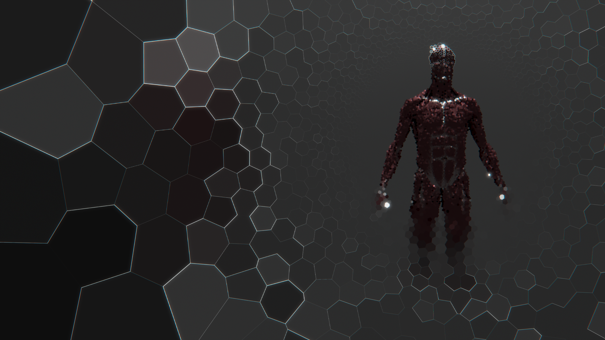

# HOST

An embodied agent simulation: a real-time physically based render engine paired with a biologically-grounded cognitive architecture.



## Overview

- **Render engine** (`notes/engine.md`, code in [`engine/`](engine/)) — a GPU path tracer built progressively from a direct-lighting ray tracer toward full spectral, unbiased global illumination.
- **Agent sensor & spatial state** (`notes/agent.md`) — a point-sampled retinal sensor that casts rays into the engine's scene and packs RGB-D-normal signal for the agent.
- **Cognitive architecture** (`notes/neural.md`) — a recurrent loop (Retina → Visual cortex → Neocortex → Basal ganglia → Motor output) modelled on anatomical analogues.

The three pieces close a loop: the engine renders the environment, the agent's retina samples it, the cognitive architecture decides on an action, and motor output updates the agent's state in the environment.

## Setup

ENGINE is checked out as a git submodule under `engine/`. Clone with submodules included:

```
git clone --recurse-submodules https://github.com/epochlab/HOST.git
```

If you already have a clone without the submodule, initialise it with:

```
git submodule update --init --recursive
```

To pull in upstream ENGINE changes later:

```
git submodule update --remote engine
```

## Notes

Design documents live under [notes/](notes/):

- [engine.md](notes/engine.md) — render engine phases and pipeline
- [agent.md](notes/agent.md) — retina sensor and spatial state
- [neural.md](notes/neural.md) — cognitive architecture
- [architect.md](notes/architect.md) — architecture planning notes
