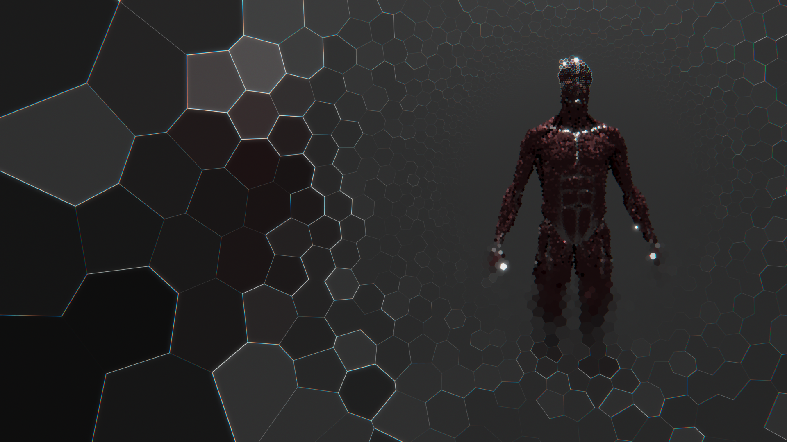

# HOST

## Overview

- **Renderer** ([`PATHTRACER/`](PATHTRACER/README.md)): a physically-based CPU Monte Carlo path tracer (Intel Embree), simulating both light transport and sensor response.
- **Cognitive architecture** ([`NN/`](NN/README.md)): a recurrent loop (Retina → Visual cortex → Neocortex → Basal ganglia → Motor output) modelled on anatomical analogues.